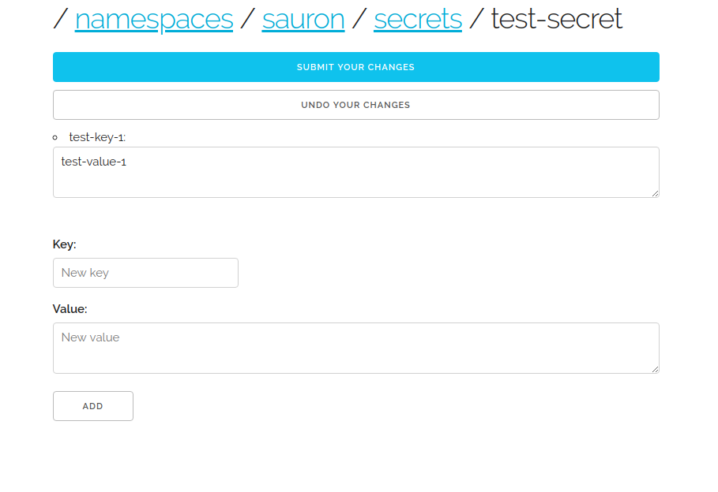

# sauron

Sauron is a web interface to your Kubernetes `ConfigMap` and `Secret` resources.

It is meant for developers who deploy applications to Kubernetes clusters but who find it difficult
to pass runtime configuration to those applications using the `kubectl` command line tool.

If this sounds familiar, Sauron may be for you.

Sauron looks like this:




## Take Sauron for a spin

If you don't have a Kubernetes cluster handy, you can spin one up locally using
[`kind`](https://github.com/kubernetes-sigs/kind) or
[`minikube`](https://kubernetes.io/docs/tasks/tools/install-minikube/).

Assuming you have a Kubernetes cluster on which you can try this out, point your `kubectl` at that
cluster (`kubectl config use-context` if necessary) and run the following commands from the root of
this repository:
```
kubectl apply -f k8s/setup.yaml
kubectl apply -f k8s/pod.yaml
```

NOTE: This assumes that you do not already have a Kubernetes namespace called `mordor` on your
cluster. If you do already have such a namespace, you should change the namespace in the manifests
above to one that doesn't already exist on your cluster. Also, we should be friends.

To connect to Sauron:
```
kubectl -n mordor port-forward sauron 1729
```

Now go here: [localhost:1729](http://localhost:1729).
